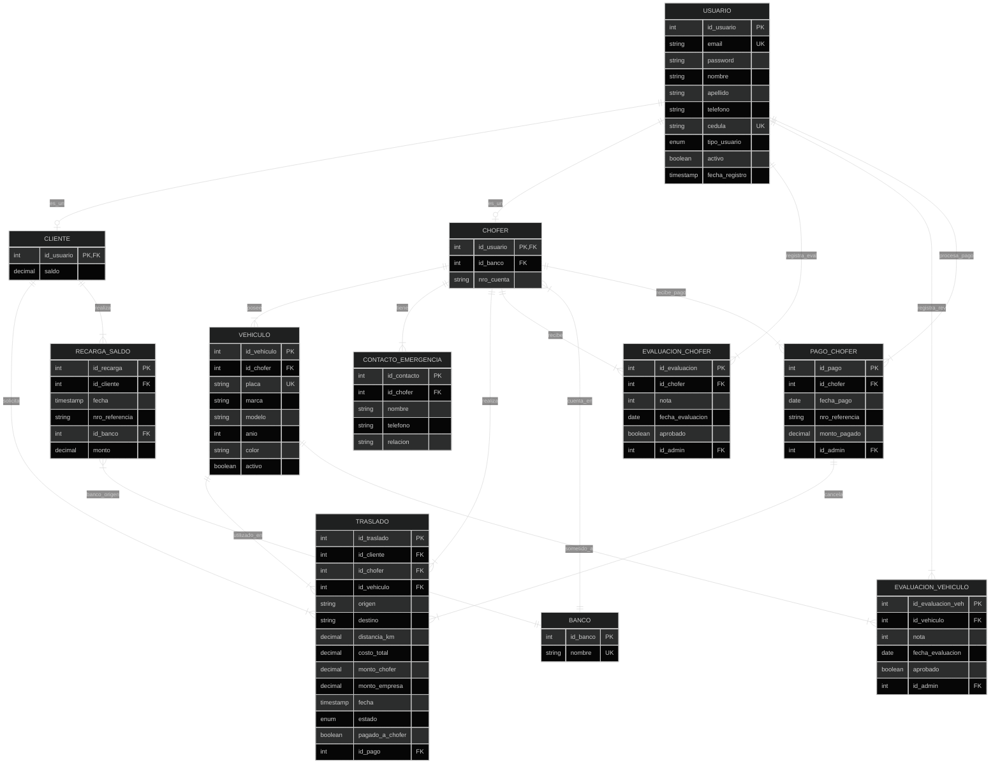

# Sistema de Base de Datos - Decarrerita

Este documento contiene el planteamiento del problema, las reglas de negocio, el diseño conceptual (MER), el diseño lógico (Modelo Relacional) y el diccionario de datos para la base de datos del sistema **Decarrerita**, una empresa de transporte urbano basada en flota liviana.

---

## 1. Planteamiento del Problema y Reglas de Negocio

**Decarrerita** es una empresa de transporte de pasajeros en la ciudad que opera mediante una flota liviana. Los vehículos pertenecen a los choferes y no a la empresa. Para el correcto funcionamiento del sistema, se han definido las siguientes entidades y sus respectivas reglas de negocio:

### 1.1. Choferes y Admisión
*   **Evaluación Psicológica:** Cada chofer postulante debe realizar una prueba psicológica calificada de 0 a 100.
    *   *Nota mínima aprobatoria:* **73**.
    *   Se debe registrar la nota obtenida, la fecha de la prueba y el personal administrativo que la cargó.
    *   Esta prueba tiene una vigencia de **1 año** (365 días), por lo que debe renovarse anualmente.
*   **Vehículos:** Los choferes registran sus vehículos propios. Un chofer puede tener **varios vehículos** registrados.
    *   *Revisión Técnica:* Cada vehículo debe someterse a una revisión física/mecánica anual (calificada de 0 a 100).
    *   *Nota mínima aprobatoria:* **65**.
    *   Se debe registrar la nota, la fecha de revisión y el personal administrativo evaluador.
    *   Esta revisión tiene una vigencia de **1 año**.
*   **Estado de Aptitud:** Un chofer está **apto para realizar traslados** si y solo si:
    1.  Tiene una evaluación psicológica aprobada y vigente (< 1 año desde la fecha de evaluación).
    2.  Tiene al menos un vehículo registrado que cuente con una revisión técnica aprobada y vigente (< 1 año).
*   **Datos del Chofer:** Deben registrarse sus datos personales (nombre, apellido, cédula, teléfono, email, contraseña), la entidad bancaria, el número de cuenta corriente/ahorros y al menos **dos contactos de emergencia** (nombre, teléfono y relación).

### 1.2. Clientes
*   Los clientes deben registrarse en el sistema con sus datos personales (nombre, apellido, cédula, teléfono, email, contraseña).
*   **Saldo de Usuario (Wallet):** Para solicitar traslados, el cliente debe poseer saldo a favor.
    *   **Recargas:** El cliente realiza transferencias o depósitos bancarios a las cuentas de la empresa y registra la recarga en el sistema indicando: *fecha, número de referencia bancaria, banco de origen, banco de destino (de la empresa) y monto*.
    *   El saldo del cliente se incrementa al validar/guardar la recarga.
    *   El cliente puede consultar su saldo actual y ver su historial completo de recargas.

### 1.3. Traslados y Asignación
*   Un cliente solicita un traslado especificando un punto de origen "A" y un punto de destino "B" en la ciudad.
*   **Algoritmo de Cálculo de Costo (Tarifa):**
    El costo de cada traslado se calcula de manera discrecional mediante la siguiente fórmula:
    $$\text{Costo Total} = \text{Tarifa Base} + (\text{Distancia en Km} \times \text{Tarifa por Km})$$
    *   *Tarifa Base (Banderazo):* $\$2.50$ (Cubre los costos iniciales y de despacho).
    *   *Tarifa por Kilómetro:* $\$1.20$ por km.
    *   *Distancia:* Calculada mediante simulación de coordenadas o entrada de distancia (en km).
    *   *Ejemplo:* Un viaje de $8 \text{ km}$ tendrá un costo de: $2.50 + (8 \times 1.20) = \$12.10$.
*   **Asignación de Chofer:**
    Al solicitar el traslado, el sistema filtra a los choferes que están **aptos** (con pruebas de chofer y vehículo vigentes y aprobadas). De este subconjunto, se selecciona uno de manera **aleatoria** para garantizar equidad.
*   **Distribución Financiera (Comisión):**
    *   El costo del traslado se descuenta inmediatamente del saldo del cliente.
    *   La empresa cobra una comisión del **30%** sobre el costo del traslado.
    *   El chofer recibe el **70%** restante, el cual se acumula como saldo pendiente por pagar (por parte de la empresa al chofer).
    *   Se registran los datos del traslado: origen, destino, distancia, costo total, monto chofer, monto empresa, fecha, chofer asignado, vehículo asignado y cliente que solicitó.
    *   El cliente puede visualizar de inmediato los datos del chofer (nombre, teléfono) y del vehículo (marca, modelo, placa, color).

### 1.4. Personal Administrativo y Operaciones
*   El personal administrativo registra las notas de las evaluaciones psicológicas de los choferes y de revisión técnica de los vehículos.
*   **Cancelación de Traslados a Choferes (Pagos):**
    El término "cancelar" en este contexto se refiere al **pago** de los traslados devengados por los choferes.
    *   El administrativo consulta los traslados completados de un chofer que están *pendientes por pagar*.
    *   Registra el pago indicando: *fecha del pago, número de referencia de la transferencia bancaria y el monto pagado*.
    *   El sistema asocia este pago a los traslados correspondientes y los marca como *pagados (cancelados)*.
*   **Reportes Administrativos:**
    *   Visualizar las ganancias totales obtenidas por la empresa (30% de comisiones) dentro de un periodo de tiempo.
    *   Visualizar el monto total pagado a un chofer específico dentro de un rango de fechas.

---

## 2. Tipos de Usuarios y Permisos

El sistema cuenta con 4 roles principales (los 5 tipos mencionados en la solicitud se consolidan en estos 4 roles únicos de acceso):

| Rol / Tipo de Usuario | Permisos y Operaciones |
| :--- | :--- |
| **Administrador** | Control total del sistema, configuración de parámetros del negocio (tarifas), gestión de usuarios y visualización de reportes globales. |
| **Personal Administrativo** | Registra evaluaciones de choferes y vehículos, gestiona tablas base (bancos), efectúa los pagos a los choferes, y visualiza reportes de ganancias y pagos de choferes. |
| **Chofer** | Crea su cuenta, gestiona sus vehículos, consulta su historial de traslados realizados (indicando cuáles ya le fueron pagados y cuáles están pendientes de pago), y visualiza sus datos personales. |
| **Cliente** | Crea su cuenta, gestiona sus datos, recarga saldo de forma manual (registrando referencia bancaria), solicita traslados, visualiza su saldo actual, historial de recargas e historial de traslados. |

---

## 3. Modelo Entidad - Relación (MER)

A continuación se muestra el diagrama Entidad-Relación conceptual que modela el negocio de Decarrerita:

---

## 4. Modelo Relacional (Esquema Lógico)

A continuación se detalla la traducción del MER al esquema de tablas relacionales con sus llaves primarias (PK), foráneas (FK) y restricciones:

1.  **bancos**
    *   `id_banco` INT AUTO_INCREMENT [PK]
    *   `nombre` VARCHAR(100) NOT NULL UNIQUE
2.  **usuarios**
    *   `id_usuario` INT AUTO_INCREMENT [PK]
    *   `email` VARCHAR(150) NOT NULL UNIQUE
    *   `password` VARCHAR(255) NOT NULL
    *   `nombre` VARCHAR(100) NOT NULL
    *   `apellido` VARCHAR(100) NOT NULL
    *   `telefono` VARCHAR(20) NOT NULL
    *   `cedula` VARCHAR(20) NOT NULL UNIQUE
    *   `tipo_usuario` ENUM('administrador', 'chofer', 'cliente', 'personal_administrativo') NOT NULL
    *   `activo` BOOLEAN NOT NULL DEFAULT TRUE
    *   `fecha_registro` TIMESTAMP DEFAULT CURRENT_TIMESTAMP
3.  **clientes**
    *   `id_usuario` INT [PK, FK -> usuarios(id_usuario) ON DELETE CASCADE]
    *   `saldo` DECIMAL(10,2) NOT NULL DEFAULT 0.00 [Restricción: saldo >= 0.00]
4.  **choferes**
    *   `id_usuario` INT [PK, FK -> usuarios(id_usuario) ON DELETE CASCADE]
    *   `id_banco` INT NOT NULL [FK -> bancos(id_banco)]
    *   `nro_cuenta` VARCHAR(30) NOT NULL
5.  **contactos_emergencia**
    *   `id_contacto` INT AUTO_INCREMENT [PK]
    *   `id_chofer` INT NOT NULL [FK -> choferes(id_usuario) ON DELETE CASCADE]
    *   `nombre` VARCHAR(150) NOT NULL
    *   `telefono` VARCHAR(20) NOT NULL
    *   `relacion` VARCHAR(50) NOT NULL
6.  **evaluaciones_choferes**
    *   `id_evaluacion` INT AUTO_INCREMENT [PK]
    *   `id_chofer` INT NOT NULL [FK -> choferes(id_usuario) ON DELETE CASCADE]
    *   `nota` INT NOT NULL [Restricción: nota BETWEEN 0 AND 100]
    *   `fecha_evaluacion` DATE NOT NULL
    *   `aprobado` BOOLEAN GENERATED ALWAYS AS (nota >= 73) STORED
    *   `id_admin` INT NOT NULL [FK -> usuarios(id_usuario)]
7.  **vehiculos**
    *   `id_vehiculo` INT AUTO_INCREMENT [PK]
    *   `id_chofer` INT NOT NULL [FK -> choferes(id_usuario) ON DELETE CASCADE]
    *   `placa` VARCHAR(15) NOT NULL UNIQUE
    *   `marca` VARCHAR(50) NOT NULL
    *   `modelo` VARCHAR(50) NOT NULL
    *   `anio` INT NOT NULL
    *   `color` VARCHAR(30) NOT NULL
    *   `activo` BOOLEAN NOT NULL DEFAULT TRUE
8.  **evaluaciones_vehiculos**
    *   `id_evaluacion_veh` INT AUTO_INCREMENT [PK]
    *   `id_vehiculo` INT NOT NULL [FK -> vehiculos(id_vehiculo) ON DELETE CASCADE]
    *   `nota` INT NOT NULL [Restricción: nota BETWEEN 0 AND 100]
    *   `fecha_evaluacion` DATE NOT NULL
    *   `aprobado` BOOLEAN GENERATED ALWAYS AS (nota >= 65) STORED
    *   `id_admin` INT NOT NULL [FK -> usuarios(id_usuario)]
9.  **recargas_saldo**
    *   `id_recarga` INT AUTO_INCREMENT [PK]
    *   `id_cliente` INT NOT NULL [FK -> clientes(id_usuario)]
    *   `fecha` TIMESTAMP DEFAULT CURRENT_TIMESTAMP
    *   `nro_referencia` VARCHAR(50) NOT NULL
    *   `id_banco` INT NOT NULL [FK -> bancos(id_banco)]
    *   `monto` DECIMAL(10,2) NOT NULL [Restricción: monto > 0.00]
10. **pagos_choferes**
    *   `id_pago` INT AUTO_INCREMENT [PK]
    *   `id_chofer` INT NOT NULL [FK -> choferes(id_usuario)]
    *   `fecha_pago` DATE NOT NULL
    *   `nro_referencia` VARCHAR(50) NOT NULL
    *   `monto_pagado` DECIMAL(10,2) NOT NULL [Restricción: monto_pagado > 0.00]
    *   `id_admin` INT NOT NULL [FK -> usuarios(id_usuario)]
11. **traslados**
    *   `id_traslado` INT AUTO_INCREMENT [PK]
    *   `id_cliente` INT NOT NULL [FK -> clientes(id_usuario)]
    *   `id_chofer` INT NOT NULL [FK -> choferes(id_usuario)]
    *   `id_vehiculo` INT NOT NULL [FK -> vehiculos(id_vehiculo)]
    *   `origen` VARCHAR(255) NOT NULL
    *   `destino` VARCHAR(255) NOT NULL
    *   `distancia_km` DECIMAL(5,2) NOT NULL
    *   `costo_total` DECIMAL(10,2) NOT NULL
    *   `monto_chofer` DECIMAL(10,2) GENERATED ALWAYS AS (costo_total * 0.70) STORED
    *   `monto_empresa` DECIMAL(10,2) GENERATED ALWAYS AS (costo_total * 0.30) STORED
    *   `fecha` TIMESTAMP DEFAULT CURRENT_TIMESTAMP
    *   `estado` ENUM('pendiente', 'completado', 'cancelado_empresa') NOT NULL DEFAULT 'completado'
    *   `pagado_a_chofer` BOOLEAN NOT NULL DEFAULT FALSE
    *   `id_pago` INT NULL [FK -> pagos_choferes(id_pago) ON DELETE SET NULL]

---

## 5. Diccionario de Datos (Resumen de Campos Clave)

### Tabla: `usuarios`
Almacena las credenciales y datos básicos de todos los actores en el sistema.
*   `tipo_usuario`: Define los permisos mediante roles ('administrador', 'chofer', 'cliente', 'personal_administrativo').
*   `cedula` / `email`: Campos únicos indexados para inicio de sesión e identificación legal.

### Tabla: `clientes`
Extiende a `usuarios`. Almacena el estado financiero directo del cliente.
*   `saldo`: Balance actual de dinero virtual. Es modificado por las recargas (suma) y por los traslados solicitados (resta).

### Tabla: `choferes`
Extiende a `usuarios`. Contiene los datos para las transferencias y el abono de sus servicios.
*   `nro_cuenta` y `id_banco`: Cuenta bancaria de destino para los pagos de traslados acumulados.

### Tabla: `evaluaciones_choferes`
*   `nota`: Valor numérico (0-100).
*   `aprobado`: Campo autocalculado persistido en disco (`nota >= 73`).
*   `fecha_evaluacion`: Sirve para calcular la vigencia de 1 año con `DATEDIFF(CURRENT_DATE, fecha_evaluacion) <= 365`.

### Tabla: `evaluaciones_vehiculos`
*   `nota`: Valor numérico (0-100).
*   `aprobado`: Campo autocalculado persistido en disco (`nota >= 65`).
*   `fecha_evaluacion`: Control de vigencia anual del vehículo.

### Tabla: `traslados`
*   `costo_total`: El cobro final al cliente.
*   `monto_chofer`: El 70% del traslado, calculado de forma determinista para evitar discrepancias de redondeo manual.
*   `monto_empresa`: El 30% restante (ganancia bruta de la empresa).
*   `pagado_a_chofer`: Indica si este traslado ya fue cubierto en un lote de transferencias bancarias por el personal administrativo.
